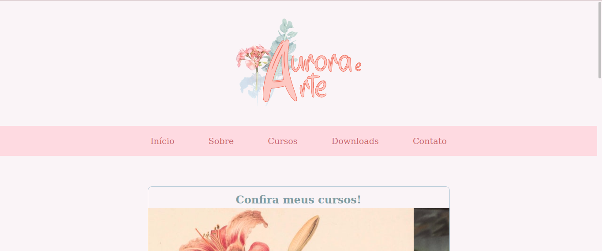
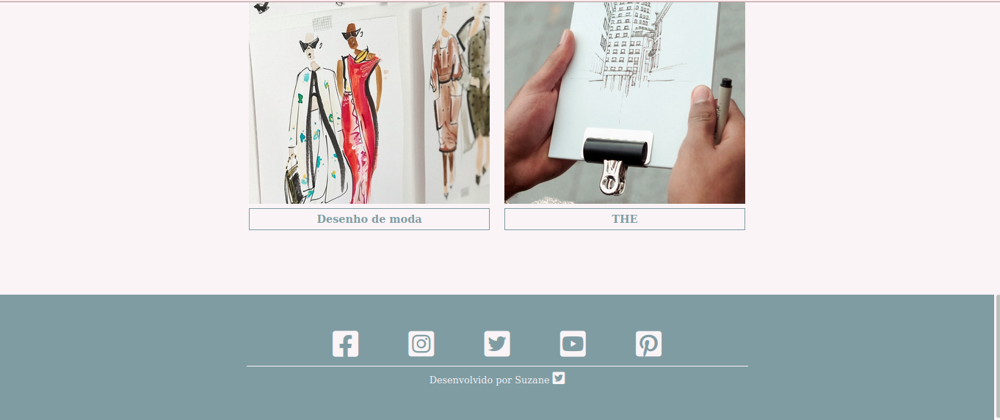
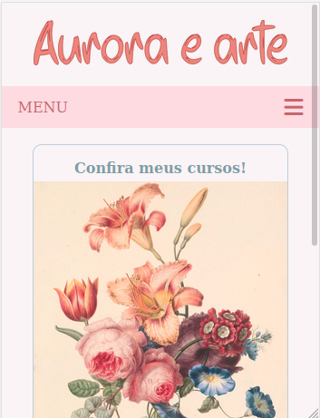
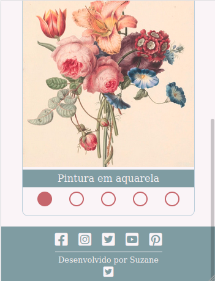
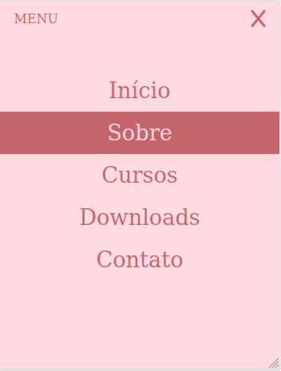
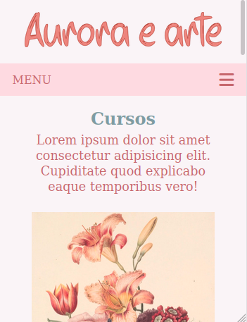

# Aurora e arte :pencil:

Este projeto traz um site institucional básico sobre os serviços de uma artista. Nele são apresentadas as informações de seus cursos, uma área de "sobre", seção de downloads e uma página de contato.

Neste site são utilizados conceitos de CSS Flexbox, Grid Layout e responsividade.

## :gear: Tecnologias

- HTML
- CSS
- JavaScript

## :art: Layout

